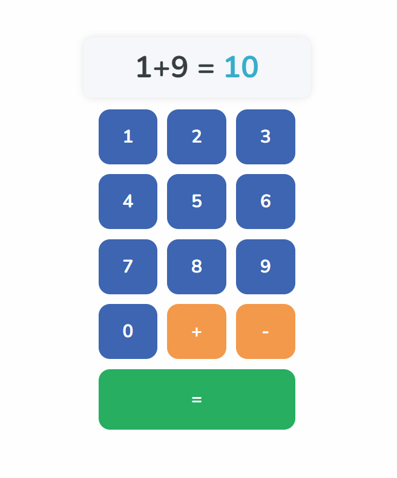

# Calculater Web App
This is a simple calculator web app that can perform basic arithmetic operations.

` this is the first Assignment in the GazaSkyGeeks React Course `

> [!NOTE]
> (Currenly only addition, subtraction).

    
    
    

## Screenshot

